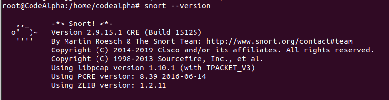
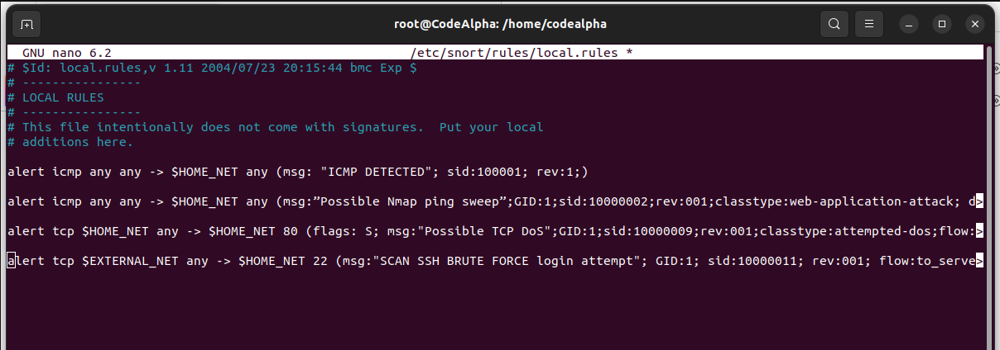
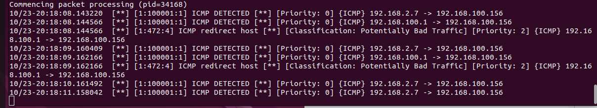
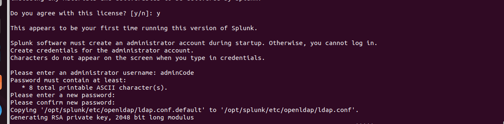
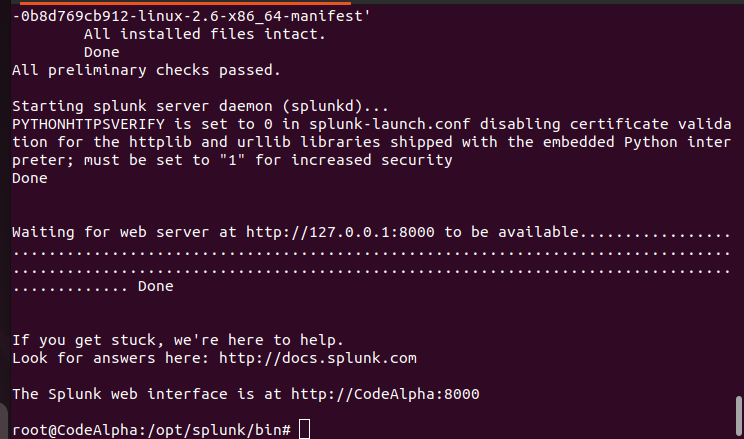
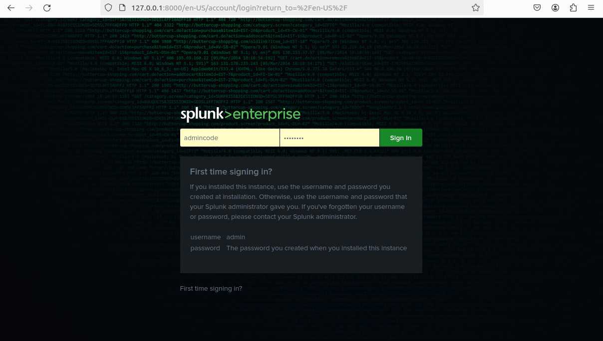
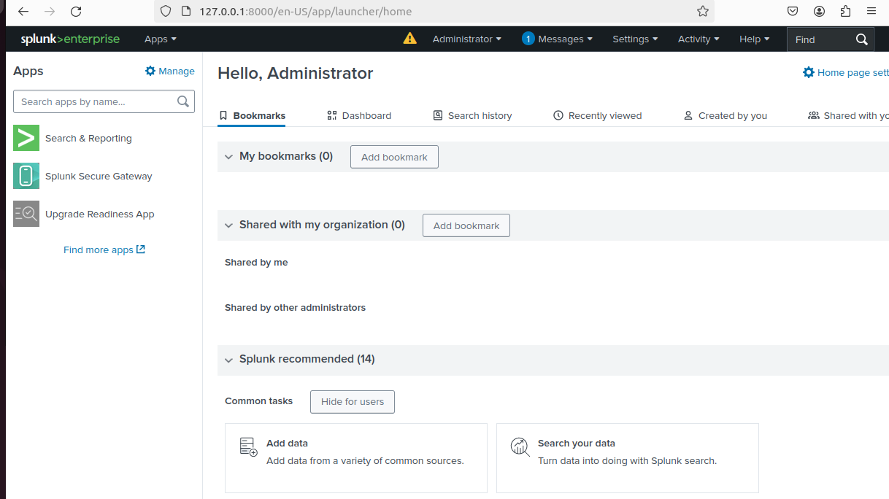
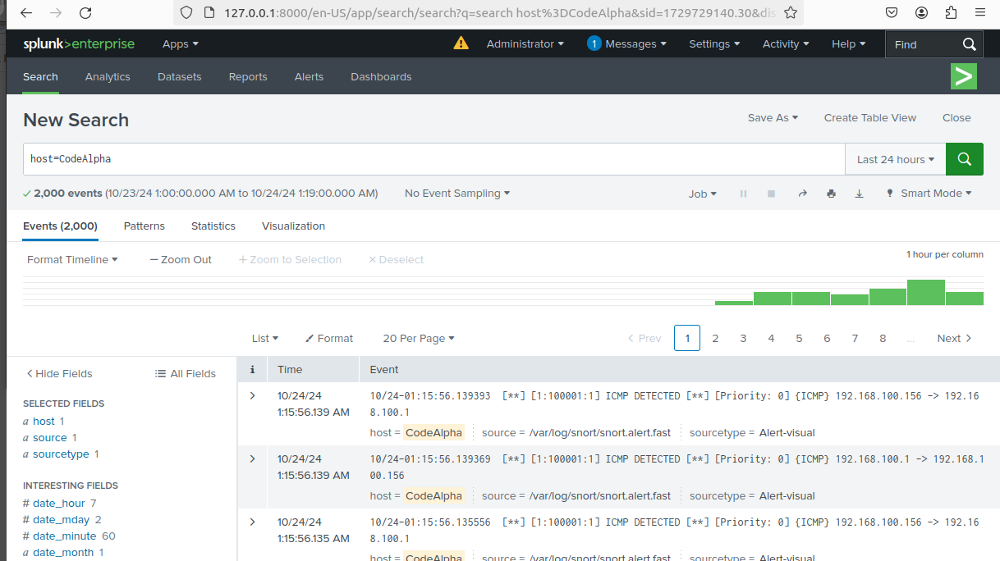

# TASK 4 : Network Intrusion Detection System

## Description

Develop a network-based intrusion detection system
using tools like Snort or Suricata. Set up rules and alerts
to identify and respond to suspicious network activity.
You can even visualize the detected attacks.

---

# Installing and configuring Snort with Splunk

## Table of contents
- [1. System update](#1-system-update)
- [2. Snort installation](#2-snort-installation)
- [3. Snort configuration](#3-snort-configuration)
- [4. Configuring Snort alert rules](#4-configuring-snort-alert-rules)
- [5. Snort configuration test](#5-snort-configuration-test)
- [6. Downloading and installing Splunk](#6-downloading-and-installing-splunk)
- [7. Start and configure Splunk](#7-start-and-configure-splunk)
- [8. Access Splunk interface](#8-access-splunk-interface)

## 1. System update
Before installing anything, make sure your system is up to date. This ensures that you have the latest security fixes and software compatibility.

```bash
sudo apt update
sudo apt upgrade
```

## 2. Snort installation
Snort is a network intrusion detection tool (NIDS). To install it on your Linux system, run the following command:

```bash
sudo apt install snort
```

Check that the installation has gone smoothly and display the Snort version:

```bash
snort --version
```
For my part, I've installed : `Version 2.9.15.1`.

<p align='center'>
  
</p>

## 3. Snort configuration
Edit the Snort configuration file to define your network settings:

```bash
sudo nano /etc/snort/snort.conf
```

Find and modify the following line:

```bash
ipvar HOME_NET any
```

Replace `any` with your network range, for example :

```bash
ipvar HOME_NET 192.168.1.0/24
```

Next, enable alerts to be logged in the system log :

```bash
# output alert_syslog: LOG_AUTH LOG_ALERT
```

## 4. Configuring Snort alert rules
To customize the alerts Snort generates, edit the `local.rules` file:

```bash
sudo nano /etc/snort/rules/local.rules
```

Add the following rules:

- **ICMP detection** :
   ```bash
   alert icmp any any -> $HOME_NET any (msg: "ICMP DETECTED"; sid:100001; rev:1;)
   ```

- **Nmap scan** :
   ```bash
   alert icmp any any -> $HOME_NET any (msg:"Possible Nmap ping sweep"; GID:1; sid:10000002; rev:001; classtype:web-application-attack;)
   ```

- **TCP DoS attempt** :
   ```bash
   alert tcp $HOME_NET any -> $HOME_NET 80 (flags: S; msg:"Possible TCP DoS"; GID:1; sid:10000009; rev:001; classtype:attempted-dos; flow:to_server;)
   ```

- **SSH brute force** :
   ```bash
   alert tcp $EXTERNAL_NET any -> $HOME_NET 22 (msg:"SCAN SSH BRUTE FORCE login attempt"; GID:1; sid:10000011; rev:001; flow:to_server;)
   ```

<p align='center'>
  
</p>

Save and close the file.

## 5. Snort configuration test
Before starting Snort, check the syntax of your :

```bash
sudo snort -T -i enp0s3 -c /etc/snort/snort.conf
```

To run Snort in console mode :

```bash
sudo snort -A console -i enp0s3 -c /etc/snort/snort.conf
```

<p align='center'>
  
</p>

## 6. Downloading and installing Splunk
Splunk is a log management and analysis platform. Download it here:

1. Go to [https://www.splunk.com/](https://www.splunk.com/).
2. Download the Splunk for Linux version.
3. Install the downloaded package:

```bash
sudo dpkg -i ./splunk-9.3.1-0b8d769cb912-linux-2.6-amd64.deb
```

## 7. Start and configure Splunk
After installing and configuring the utilistators account (login and password), start the Splunk service:

```bash
sudo /opt/splunk/bin/splunk start
```
<p align='center'>
  
</p>

<p align='center'>
  
</p>

To have Splunk start automatically when your server starts :

```bash
/opt/splunk/bin/splunk enable boot-start
```

Check Splunk status:

```bash
/opt/splunk/bin/splunk status
```

## 8. Access Splunk interface
Once Splunk has been started, access its web interface:

```
http://localhost:8000
```

Log in with the previously defined credentials to start using Splunk and integrate Snort logs.

<p align='center'>
  
</p>

<p align='center'>
  
</p>

## Results : Ping Alerts

<p align='center'>
  
</p>

---

For a complete demonstration of installing and configuring Snort with Splunk, watch the following video: 
